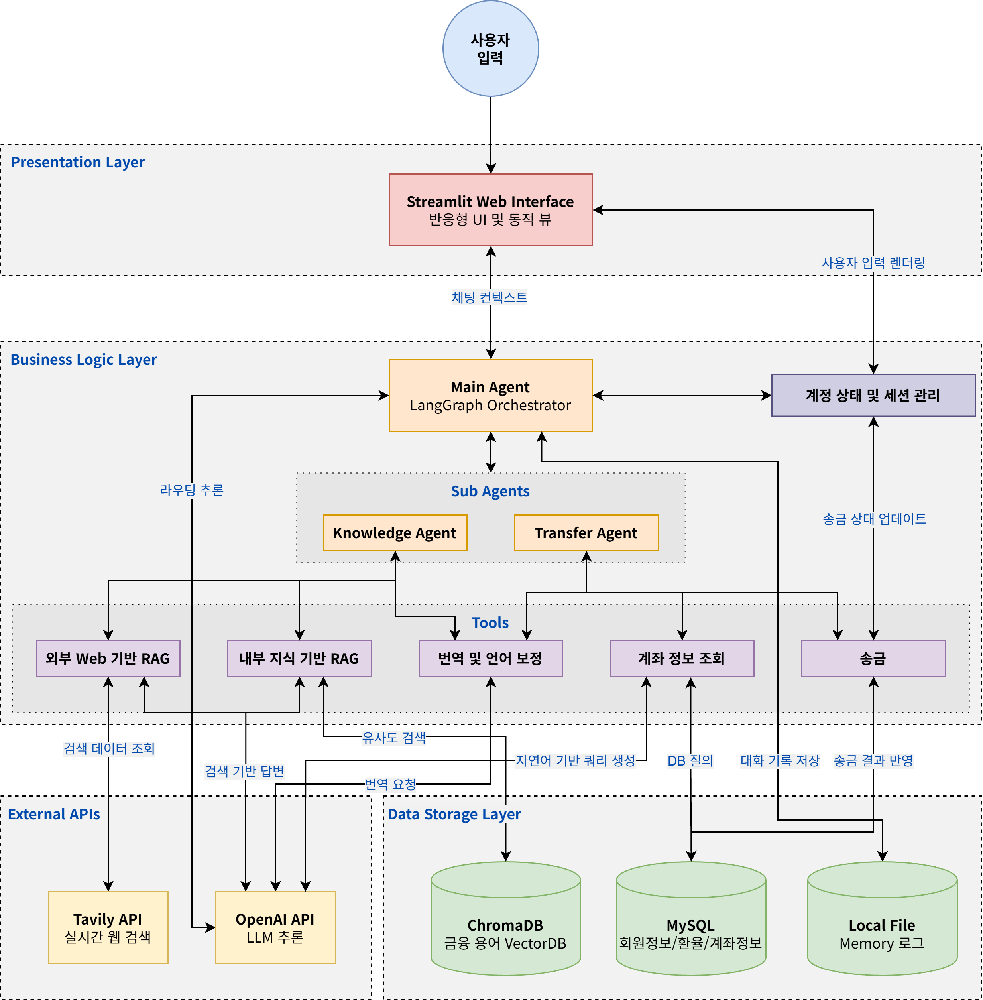
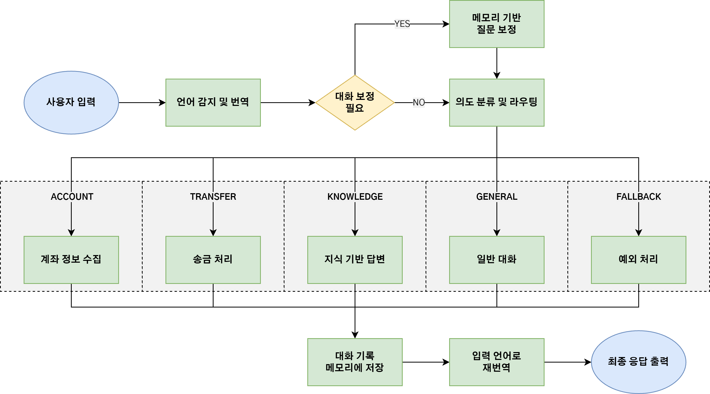
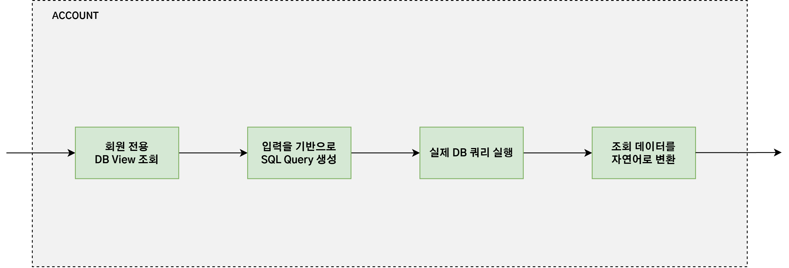
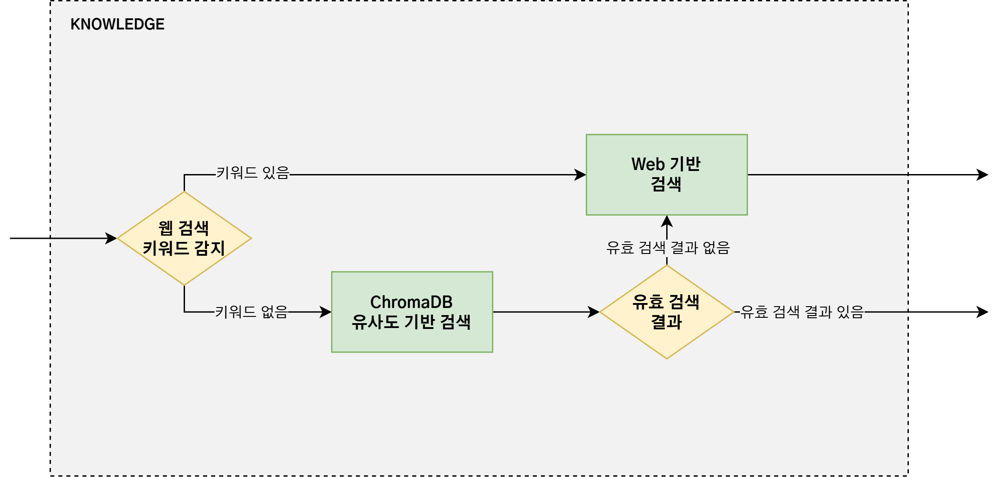
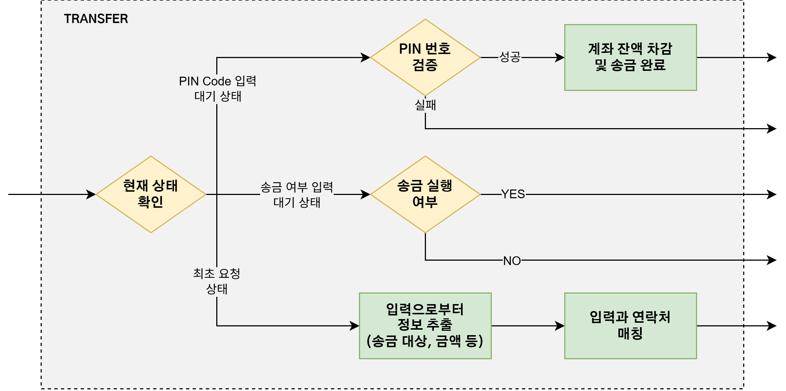
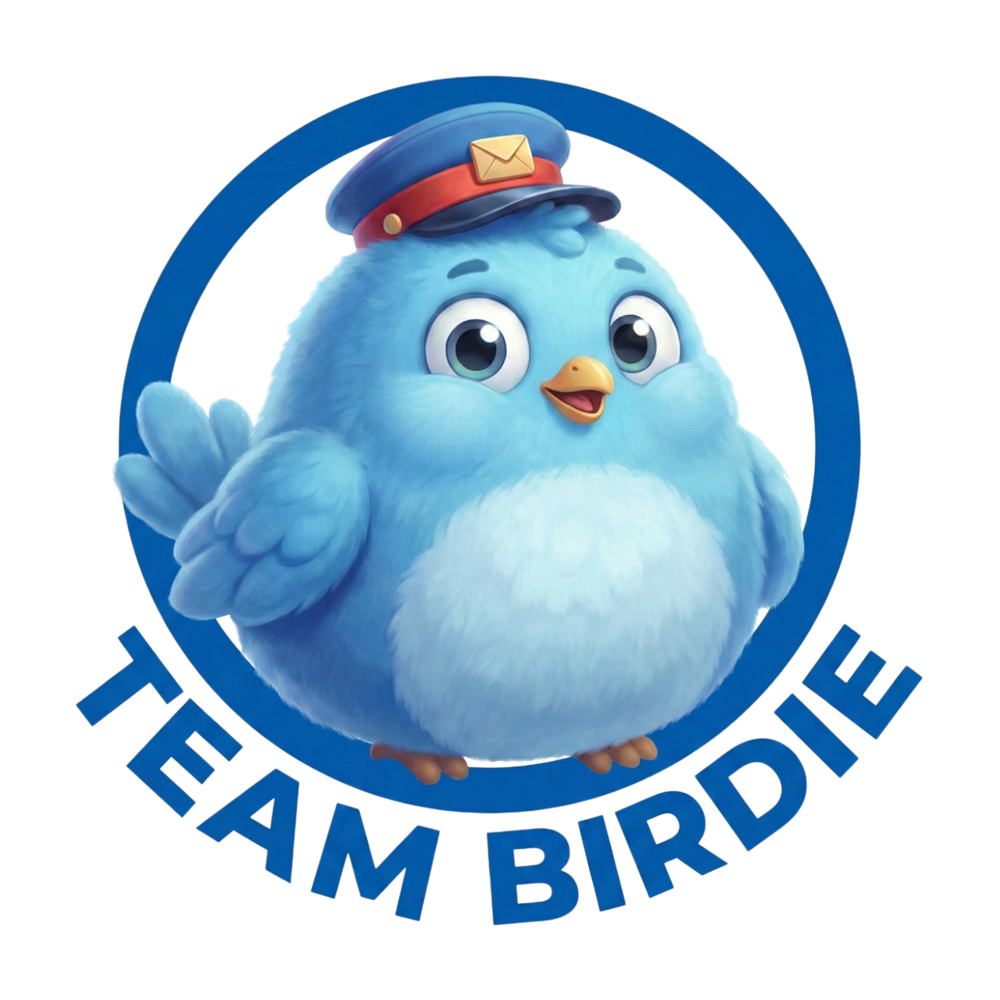

<div align="center">
  
</div>

# 벗 (BeoTT): 대한외국인의 더 쉬운 금융 생활을 위한 맞춤형 AI Agent 서비스
**Bridge for easy overseas Transaction & Translator**

> **"한국에서의 복잡한 금융 업무, 당신의 든든한 친구 '벗(BeoTT)'과 챗봇 '버디'가 도와줄게요!"**

<br/>

<div align="center">
  
  <p><em>여러분의 친절한 금융 친구, '버디'입니다!</em></p>
</div>

<br/>

## 📖 프로젝트 소개 (About the Project)

**벗(BeoTT)** 은 낯선 대한민국에 거주하는 외국인(이하 '대한외국인')들이 언어적 장벽과 복잡한 금융 서비스로 인해 겪는 어려움을 해결하기 위해 탄생했습니다.

* **'벗'의 의미**: 외국인들이 대한민국 금융 서비스를 잘 적응하고 이용할 수 있도록 곁에서 도와주는 진정한 '친구'
* **BeoTT**: **B**ridge for **e**asy **o**verseas **T**ransaction & **T**ranslator (간편한 해외거래 및 번역을 위한 다리)

### 🎯 프로젝트 목적
대한외국인들이 익숙한 언어로 대한민국 금융 용어에 대한 친절한 설명을 듣고, 간편한 과정으로 대한민국 금융 서비스를 이용할 수 있도록 돕는 것이 핵심 목표입니다.

<br/>

## ✨ 핵심 기능 (Key Features)

1. **🌐 실시간 다국어 번역 인터페이스 (Translation)**
   - 사용자의 입력 언어를 자동 감지하여 처리하고, 챗봇 '버디'의 최종 답변은 다시 사용자의 익숙한 모국어로 번역하여 제공합니다.

2. **📚 맞춤형 금융 용어 해설 및 실시간 검색 (Knowledge & Web Search)**
   - 어려운 한국의 금융/경제 용어를 내부 데이터(RAG)를 기반으로 쉽게 설명합니다. 내부 데이터에 없는 최신 정보(실시간 환율, 경제 뉴스 등)는 웹 검색 에이전트를 연계해 실시간으로 찾아 답변합니다.

3. **💸 대화형 송금 및 금융 거래 (Transaction)**
   - 복잡한 화면 대신, '버디'와 대화하듯 자연스럽고 간편하게 송금 프로세스를 진행합니다. 동적인 확인/취소 버튼으로 안전한 거래를 돕습니다.

4. **📊 사용자 맞춤형 DB 조회 (Database)**
   - 사용자의 계좌 내역, 잔액, 등록된 연락처 등을 안전하게 조회하고 맞춤형 답변을 생성합니다.

<br/>

## 🏗 시스템 아키텍처 (System Architecture)

BeoTT 서비스는 **LangGraph**를 기반으로 한 다중 에이전트(Multi-Agent) 시스템으로 구성되어 유연하고 강력한 성능을 자랑합니다.

<div align="center">
  
</div>

* **다국어 입력 및 번역 노드**: 사용자의 다국어 입력을 한국어로 번역하고, 대화의 맥락을 파악하여 질문을 정교하게 보정합니다.
* **의도 분류 라우터(Router)**: 보정된 질문의 의도를 분석하여, 전문 하위 에이전트(Account, Knowledge, Transfer)로 작업을 동적 분배(라우팅)합니다.
* **최종 답변 및 역번역**: 에이전트가 데이터 검색 및 판단을 통해 생성한 한국어 답변을 다시 사용자의 모국어로 변환하여 출력합니다.

<br/>

## 🤖 전문 Agent 동작 흐름 (Agents Flowchart)

### 1. Main Agent Flow
메인 에이전트는 사용자의 입력부터 최종 출력까지의 전체 오케스트레이션을 담당합니다.
<div align="center">
  
</div>

<br/>

### 2. Sub-Agents Flow
라우팅된 요청의 성격에 따라 다음의 핵심 에이전트들이 각자의 역할을 수행합니다.

#### 🗄️ Account Agent (계좌 및 DB 조회)
사용자의 자연어 질문을 Text-to-SQL을 통해 쿼리로 변환하고, MySQL에서 개인 계좌 정보 및 연락처 등을 안전하게 조회합니다.
<div align="center">
  
</div>

#### 🧠 Knowledge Agent (금융 지식 RAG & 실시간 웹 검색)
ChromaDB에 구축된 금융/경제 용어 벡터 저장소에서 관련 지식을 검색하여 외국인의 눈높이에 맞춘 쉬운 해설을 생성합니다. **만약 내부 DB만으로 답변이 부족하거나 최신 정보가 필요할 경우, 내부적으로 Web Search Agent(Tavily API)를 호출하여 웹 검색 결과를 융합합니다.**
<div align="center">
  
</div>

#### 💸 Transfer Agent (송금 처리)
송금 프로세스에 필요한 정보(수취인, 금액 등)를 대화형으로 수집하고, 컨텍스트를 유지하며 사용자 승인 버튼을 통해 실제 송금을 안전하게 수행합니다.
<div align="center">
  
</div>

<br/>

## 🛠 기술 스택 (Tech Stack)

### Frontend
- **Streamlit**: 빠르고 직관적인 반응형 챗봇 UI
- **HTML/CSS**: 사용자 경험(UX) 향상을 위한 커스텀 스타일링

### AI & Backend
- **LangGraph & LangChain**: 다단계 에이전트 파이프라인 및 워크플로우 제어
- **OpenAI API (gpt-5-mini / gpt-4o-mini)**: 핵심 LLM 추론 및 다국어 번역 엔진
- **Tavily API**: 실시간 정보 획득을 위한 웹 검색 엔진
- **bcrypt**: 사용자 비밀번호 및 PIN 코드의 안전한 암호화 처리

### Database
- **MySQL**: 사용자 정보, 계좌 내역 등 관리
- **ChromaDB**: RAG 시스템을 위한 금융 용어 벡터 저장소

<br/>

## 🚀 시작하기 (Getting Started)

### 1. 사전 요구 사항 (Prerequisites)
- Python 3.9 이상
- MySQL 서버 실행 중
- `OpenAI API Key` 및 `Tavily API Key` (환경 변수 `.env` 파일 설정 필요)

### 2. 설치 및 환경 설정 (Installation & Setup)
```bash
# 저장소 클론
git clone https://github.com/TEAM-BIRDIE/BeoTT.git
cd BeoTT

# 필요 패키지 설치
pip install -r requirements.txt
```

### 3. 프로젝트 실행 (Run)
```bash
# Streamlit 앱 실행
streamlit run app.py
```

*처음 실행 시, 벡터 DB가 비어있다면 `utils/set_chromaDB.py` 스크립트가 자동으로 실행되어 초기 금융 용어 지식 베이스를 구축합니다.*

<br/>

## 🤝 TEAM BIRDIE

<div align="center">
  
  <br/>
  <p><b>"기술로 따뜻한 금융을 만듭니다."</b></p>
</div>

<div align="center">
  <table>
    <tr>
      <th align="center">이름</th>
      <th align="center">GitHub</th>
    </tr>
    <tr>
      <td align="center">🧑‍💻 <b>김재욱</b></td>
      <td align="center"><a href="https://github.com/finstats99"></a></td>
    </tr>
    <tr>
      <td align="center">👨‍💻 <b>이종혁</b></td>
      <td align="center"><a href="https://github.com/jonyeoke"></a></td>
    </tr>
    <tr>
      <td align="center">👨‍💻 <b>이주리</b></td>
      <td align="center"><a href="https://github.com/juri-lee54"></a></td>
    </tr>
    <tr>
      <td align="center">🧑‍💻 <b>유채린</b></td>
      <td align="center"><a href="https://github.com/yuchael"></a></td>
    </tr>
  </table>
</div>

---
*© 2026 TEAM BIRDIE (우리FISA 6기). All rights reserved.*